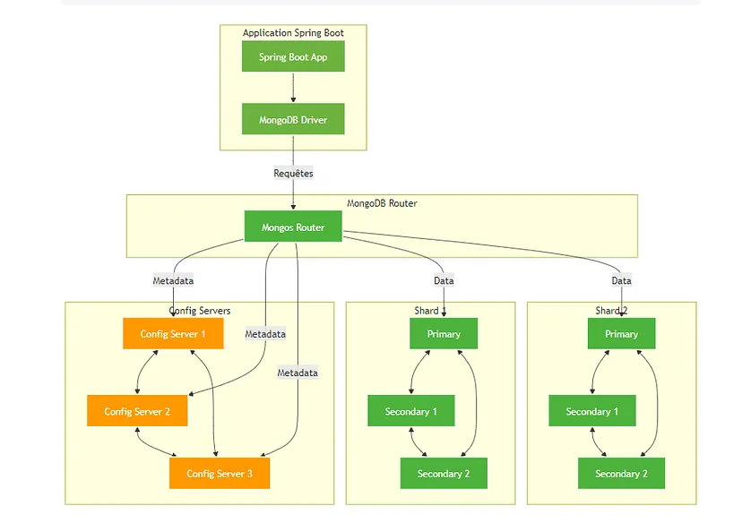

# Architecture Spring Boot avec MongoDB Sharded Cluster

Architecture distribuée utilisant MongoDB shardé avec Spring Boot.

## Composants

- Spring Boot Application (API REST)
- MongoDB Router (mongos)
- Config Servers (x3) en replica set
- 2 Shards avec chacun:
    - Primary
    - Secondary 1
    - Secondary 2

<div align="center">
  
  <p><em>Architecture MongoDB Sharded Cluster avec Spring Boot</em></p>
</div>

## Prérequis

- Docker + Docker Compose
- Java 17
- Maven
- MongoDB Shell

## Installation

1. **Démarrer le cluster MongoDB**:

```bash
cd config
chmod +x init.sh
./init.sh
```

2. **Démarrer Spring Boot**:

```bash
mvn spring-boot:run
```

## API Endpoints

- `POST /api/products` - Créer produit

```bash
curl -X POST http://localhost:8080/api/products \
-H "Content-Type: application/json" \
-d '{"name":"Product1","region":"EU","price":100}'
```

- `GET /api/products` - Liste produits

```bash
curl http://localhost:8080/api/products
```

## Structure du projet

```
.
├── config/
│   ├── docker-compose.yml
│   └── init.sh
├── src/
│   └── main/
│       ├── java/
│       │   ├── controllers/
│       │   ├── models/
│       │   └── services/
│       └── resources/
│           └── application.yml
└── pom.xml
```

## MongoDB Sharding

- Collection shardée: `products`
- Clé de sharding: `region`
- Réplication: 1 primary + 2 secondary par shard

## Commandes utiles

```bash
# Status cluster
docker exec mongodb_router mongosh --eval "sh.status()"

# Logs 
docker logs mongodb_router
docker logs mongodb_configsvr1
docker logs mongodb_shard1

# Shell MongoDB
docker exec -it mongodb_router mongosh

# Arrêter cluster
docker-compose down -v
```
